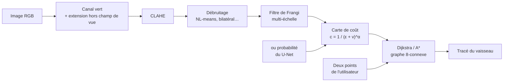
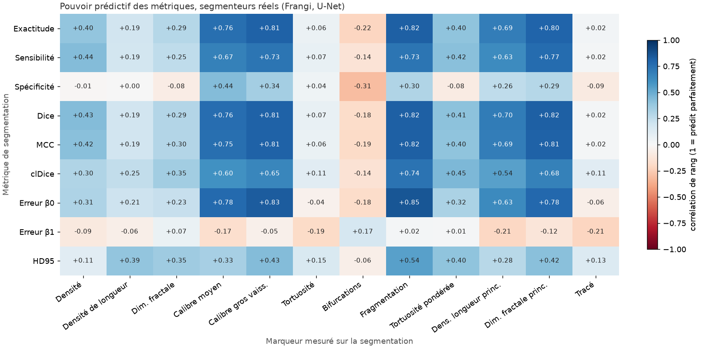

# Vaisseaux rétiniens et maladies de l'œil : tracé, mesures et dépistage

[](https://github.com/sheene123/retina-vessel-tracing/actions/workflows/ci.yml)
[](https://github.com/sheene123/retina-vessel-tracing/actions/workflows/deploiement.yml)
[](https://huggingface.co/spaces/sheenee261/retina-vessel-tracing)

**Démo en ligne : https://huggingface.co/spaces/sheenee261/retina-vessel-tracing** (tout s'exécute dans le navigateur).

Projet personnel de recherche sur les photos du fond d'œil, des données publiques jusqu'à une démo
utilisable dans le navigateur, avec une évaluation systématique sur des données jamais vues.
**Projet terminé (v1.0.0).**

- **Tracer un vaisseau** entre deux points cliqués : l'image devient un graphe de pixels et un plus
  court chemin (Dijkstra, A\*) suit le vaisseau, guidé par un filtre classique ou par le U-Net.
- **Segmenter les vaisseaux et distinguer artères et veines**, avec un U-Net entraîné sur cinq bases
  d'images venant d'appareils différents.
- **Mesurer les vaisseaux** dans des anneaux autour du nerf optique, comme les logiciels de recherche :
  largeur des artères (CRAE) et des veines (CRVE), sinuosité, densité.
- **Repérer six maladies** (rétinopathie diabétique, glaucome, cataracte, DMLA, rétinopathie
  hypertensive, myopie forte) : probabilités calibrées, cartes de chaleur, contrôle de la qualité
  de la photo.
- **MLOps** : registre de modèles versionné, comparaison champion / challenger, validation
  indépendante en CI, déploiement continu de l'API, de la démo et des releases.

## Résultats en bref

Toutes les valeurs sont mesurées sur des images que le modèle n'a pas vues à l'entraînement.

| Tâche | Résultat | Détails |
|---|---|---|
| Segmentation des vaisseaux | Dice de 0,80 à 0,87 sur quatre bases d'autres appareils (HRF, LES-AV, FIVES, CHASE_DB1), 0,84 sur DRIVE | [mesures_zones.md](docs/mesures_zones.md) |
| Artères et veines | 92 % des segments bien classés (52 photos de test), contre 73 % sans apprentissage | [mesures_zones.md](docs/mesures_zones.md) |
| Tracé d'un vaisseau (DRIVE) | F1 0,92 ; écart au chemin de l'expert de 6 pixels, contre 10 avec le meilleur filtre classique | [evaluation.md](docs/evaluation.md) |
| Mesures autour du nerf optique | corrélation de rang avec l'expert de 0,67 à 0,92 selon la mesure (52 photos de test) | [mesures_zones.md](docs/mesures_zones.md) |
| Six maladies | AUROC d'au moins 0,86 en validation croisée, et d'au moins 0,94 sur 1 000 photos d'un hôpital jamais vu (cinq maladies, test optimiste) | [troubles.md](docs/troubles.md) |

**Ce qui ne marche pas (détaillé dans la documentation) :**
- le rapport artères / veines (AVR) calculé par la chaîne complète ne suit pas l'expert (0,16), même
  avec une largeur mesurée au dixième de pixel : il n'est pas affiché ;
- les repères « yeux sains » mesurent surtout l'appareil photo, sauf pour une mesure : seule celle-ci
  est comparée à des yeux sains ;
- le tracé n'est évalué que sur DRIVE.

C'est une démonstration de recherche, pas un dispositif médical.


## Principe du tracé



1. **Prétraitement** ([pretraitement.py](src/vaisseaux/pretraitement.py)). On part du
   canal vert, le plus contrasté pour les vaisseaux. On prolonge l'image hors du champ de
   vue, pour que le bord du disque ne soit pas pris pour un vaisseau, puis on égalise
   l'histogramme localement (CLAHE). On débruite ensuite ; le niveau de bruit est estimé
   par la méthode d'Immerkær et règle le NL-means. Enfin, le filtre de Frangi
   multi-échelle donne une « probabilité vaisseau » v ∈ [0, 1] pour chaque pixel. Variante :
   v est la probabilité « vaisseau » du U-Net, ce qui divise presque par deux l'écart au chemin
   de l'expert ([docs/evaluation.md](docs/evaluation.md)).
2. **Graphe** ([graphe.py](src/vaisseaux/graphe.py)). Chaque pixel du champ de vue est
   relié à ses 8 voisins. Traverser un pixel coûte c = 1 / (ε + v)^α, soit environ 1 dans
   un vaisseau et environ 100^α dans le fond. L'arête (p, q) coûte
   d(p, q) · (c(p) + c(q)) / 2, avec d = 1 ou √2.
3. **Plus court chemin**. L'implémentation de Dijkstra utilise un tas binaire et s'arrête
   dès que la cible est atteinte. Une variante A\* utilise l'heuristique octile, admissible
   et cohérente, donc exacte. Les tests vérifient les coûts contre
   `scipy.sparse.csgraph.dijkstra`.

## Démo interactive

[Essayer en ligne](https://huggingface.co/spaces/sheenee261/retina-vessel-tracing) : cliquer deux points sur un
vaisseau, comparer deux prétraitements (ou le U-Net) sur le même tracé, afficher les vues intermédiaires (canal
vert, image rehaussée, carte de Frangi, segmentation, artères et veines, zones de mesure, vérité terrain), comparer
les sept cartes des vaisseaux et tester sa propre image.
Sur les images DRIVE, le tracé est noté face à l'annotation experte.

**Mesures vasculaires.** Un clic lance le U-Net dans le navigateur (ONNX Runtime Web, environ 2 s),
puis mesure 11 marqueurs : densité, densité de longueur, dimension fractale, calibre moyen et des
gros vaisseaux, tortuosité, bifurcations, fragments, et trois versions robustes. Sur les images DRIVE, chaque mesure est
comparée à celle de l'expert. Chaque mesure porte aussi un indicateur de fiabilité tiré de
[l'étude](docs/etude_metriques.md) (la mesure classe-t-elle les patients comme l'expert ?) et
l'accord entre deux experts sur ce marqueur. Trois images de test sont tirées au hasard à chaque
visite.
Depuis la v0.4.0, le U-Net est **multi-appareils** (5 bases d'images) et distingue **artères et veines** (92 % des
segments bien classés sur des photos de test) : la démo mesure dans des anneaux autour de la papille, avec le calibre
des artérioles (CRAE) et des veinules (CRVE), et ne situe parmi des yeux sains que la mesure qui a passé un contrôle
du biais d'appareil ([docs/mesures_zones.md](docs/mesures_zones.md)).
C'est une démonstration de recherche, pas un diagnostic.

La démo web ([demo/web/](demo/web/)) exécute le paquet Python **dans le navigateur** avec
[Pyodide](https://pyodide.org) : aucune image ne quitte l'ordinateur et l'hébergement est un simple Space
statique. Déploiement : `python scripts/deployer_space.py --space <utilisateur>/retina-vessel-tracing`.
Une variante Gradio ([demo/gradio/](demo/gradio/)) existe pour une exécution côté serveur
(`pip install gradio && python demo/gradio/app.py`).

## API

```bash
docker build -t vaisseaux .
docker run -p 8000:8000 vaisseaux
# documentation interactive : http://127.0.0.1:8000/docs

curl -F image=@data/DRIVE/test/images/02_test.tif \
     -F depart_x=300 -F depart_y=120 -F arrivee_x=360 -F arrivee_y=260 \
     http://127.0.0.1:8000/tracer
```

| Route | Rôle |
|---|---|
| `POST /tracer` | image + deux points (x = colonne, y = ligne) → liste des pixels du tracé, longueur, coût, pixels explorés, durées |
| `POST /tracer/image` | même calcul, renvoie l'image PNG avec le tracé superposé |
| `GET /sante` | sonde de vie |

Paramètres optionnels : `debruitage` (`aucun`, `gaussien`, `median`, `bilateral`,
`nl_means`), `algorithme` (`dijkstra`, `a_etoile`), `alpha`. Le prétraitement d'une image
est mis en cache : un second tracé sur la même image ne coûte que la recherche de chemin,
quelques dizaines de millisecondes.

## Évaluation

La question « mon tracé est-il bon ? » n'a pas de réponse évidente : le tracé est une
ligne, l'annotation experte est une surface, et les experts eux-mêmes ne sont pas
d'accord au pixel près. La démarche complète est dans [docs/evaluation.md](docs/evaluation.md).
En résumé :

- **Référence** : pour chaque paire de points tirée sur le squelette de l'annotation, le
  chemin géodésique le long de ce squelette.
- **Mesures de tracé** : précision et couverture avec tolérance de 2 px, F1, distance de
  Hausdorff à 95 %, distance de Fréchet (sensible à l'ordre de parcours), plus long
  écart hors d'un vaisseau (raccourci).
- **Mesures pixel** de la carte de rehaussement, **dans le champ de vue uniquement** :
  AUC, Dice, MCC, clDice. L'exactitude (*accuracy*) est trompeuse, car près de 87 % des
  pixels sont du fond.
- **Protocole** : paramètres choisis sur les 20 images d'entraînement, mesure unique sur
  les 20 images de test. Intervalles de confiance par bootstrap **sur les images** (l'image
  est l'unité statistique), test de Wilcoxon apparié corrigé par Holm.

Premiers résultats (20 images de test, 200 tracés par configuration) :

| Prétraitement | F1 tracé ↑ | Couverture ↑ | HD95 (px) ↓ | AUC pixel ↑ | MCC pixel ↑ |
|---|---|---|---|---|---|
| canal vert brut | 0,884 | 0,834 | 9,1 | 0,868 | 0,593 |
| CLAHE + NL-means | **0,885** | **0,836** | **9,0** | 0,874 | 0,606 |
| CLAHE + gaussien | 0,876 | 0,828 | 11,3 | **0,905** | **0,669** |
| CLAHE + bilatéral | 0,772 | 0,708 | 19,8 | 0,887 | 0,638 |

Le constat le plus instructif : **la meilleure carte au pixel (flou gaussien) ne donne pas
le meilleur tracé**, et le filtre bilatéral, correct au pixel, dégrade fortement les
tracés. Les mesures pixel et la tâche ne racontent pas la même histoire. Intervalles de
confiance, tests et analyse : [resultats/evaluation.md](resultats/evaluation.md) et
[docs/evaluation.md](docs/evaluation.md#6-ce-que-disent-les-résultats).

## Étude : les métriques de segmentation prédisent-elles les mesures cliniques ?

En oculomique, on mesure les vaisseaux (calibre, tortuosité, dimension fractale…) comme marqueurs
de santé, sur des segmentations choisies pour leur Dice. L'étude
([docs/etude_metriques.md](docs/etude_metriques.md)) compare 19 méthodes, dont un U-Net
(Dice 0,82) et des perturbations contrôlées, sur 380 segmentations et 8 marqueurs.

- Parmi les segmenteurs réels, le Dice prédit le calibre (+0,81) et la fragmentation (+0,82),
  mais **pas la tortuosité (+0,07), les bifurcations (-0,18) ni le tracé (+0,02)**.
- Le Dice reste à 0,98 avec 60 coupures dans les vaisseaux ; le clDice reste à 0,999 quand le
  calibre est faux de 35 %. Les deux métriques ont des angles morts complémentaires.
- À Dice égal, le seuil du U-Net change l'erreur de calibre du simple au double : il faut le
  choisir selon le marqueur.
- **Même deux experts ne classent pas les patients de la même façon** sur la plupart des marqueurs
  (corrélation de 0,03 à 0,63 entre le premier et le second expert DRIVE), et le U-Net fait
  presque aussi bien qu'eux. Le problème vient des définitions des marqueurs, pas du modèle.
- **Une tortuosité robuste** (longs segments pondérés par leur longueur) fait monter l'accord
  entre experts à 0,75, et **le U-Net y atteint le niveau humain (0,73)**.



## Étude : repérer une rétinopathie hypertensive

Premier pas vers le risque cardiovasculaire : sur ODIR-5K (2 920 yeux, 104 atteints), on
distingue les yeux avec une rétinopathie hypertensive des fonds d'œil normaux, en validation
croisée groupée par patient ([docs/hypertension.md](docs/hypertension.md)).

| Modèle | AUROC [IC 95 %] |
|---|---|
| Réseau (ResNet-18, image entière) | **0,82** [0,76 ; 0,87] |
| Marqueurs vasculaires du projet (11) | 0,72 [0,65 ; 0,78] |
| Témoin : âge et sexe | 0,53 [0,46 ; 0,61] |

L'œil contient bien l'information, et les marqueurs vasculaires en captent une partie. Mais
avec 3,6 % de cas positifs, seuls 9 % des yeux signalés par le réseau sont réellement atteints :
c'est un résultat de recherche, pas un outil de dépistage.

## Signes de six troubles de l'œil

La démo propose aussi une estimation indicative de six troubles à partir d'une photo de fond d'œil :
rétinopathie diabétique, glaucome, cataracte, DMLA, rétinopathie hypertensive et myopie forte.
L'image est d'abord recadrée automatiquement sur le fond d'œil, puis le modèle ONNX produit une
probabilité calibrée. L'interface la traduit en trois niveaux simples : **peu probable**,
**possible** ou **probable** ; les détails techniques restent disponibles séparément.

Le modèle (version 0.2.0) est entraîné sur 14 417 photos de quatre bases publiques (ODIR-5K,
RFMiD, SMDG-19, sjchoi86), dédoublonnées, avec des augmentations qui imitent les images « du monde
réel » (gros plans, compression, flou, annotations). Il est évalué deux fois : en validation
croisée groupée par patient, puis sur **1 000 photos d'un hôpital jamais vu** (JSIEC-1000), la
mesure la plus proche de ce que donneront des images venues d'ailleurs. Le seuil « possible »
dépend du trouble, pour que les troubles rares soient signalés eux aussi. Ces résultats mesurent
la capacité à reconnaître des annotations de jeux de données, pas la présence certaine d'une
maladie chez une personne.

| Trouble | AUROC validation croisée | AUROC hôpital jamais vu (JSIEC) |
|---|---|---|
| Rétinopathie diabétique | 0,90 | 0,943 (106 cas) |
| Glaucome | 0,90 | 0,9998 (13 cas) |
| Cataracte | 0,98 | pas de cas |
| DMLA | 0,94 | 0,953 (74 cas) |
| Rétinopathie hypertensive | 0,86 | 0,964 (15 cas) |
| Myopie forte | 0,996 | 0,9996 (54 cas) |

Version 0.3.0 : un professeur RETFound (modèle de fondation de la rétine) transmet son avis sur le glaucome
au petit réseau de la démo ; sur les gros plans serrés de la papille, le glaucome passe de 0,872 à
1,000 d'AUROC. La version 0.3.2 garde ce gain sans recul significatif sur les autres troubles
face à la version d'avant ([docs/troubles.md](docs/troubles.md)). La démo montre aussi les zones
regardées par le réseau (cartes de chaleur), contrôle la qualité de la photo et propose des yeux malades à
diagnostic connu. Les valeurs proches de 1 sur JSIEC sont optimistes (cas typiques, peu de cas).

La méthodologie, les effectifs et les résultats complets sont dans
[docs/troubles.md](docs/troubles.md). Les sorties du modèle sont versionnées dans
[resultats/troubles/](resultats/troubles/).

## Déploiement continu

Les modèles sont entraînés sur GPU, puis publiés dans un **registre versionné**
([Hugging Face Hub](https://huggingface.co/sheenee261/retina-vessel-tracing)) après une validation
indépendante et une comparaison avec la version en production (champion / challenger). Un tag Git
déclenche ensuite en CI une **seconde validation** : le Dice du U-Net est recalculé sur DRIVE à
partir du modèle publié. Viennent ensuite le déploiement de l'API (image GHCR), de la démo et une
release. Détails : [docs/deploiement.md](docs/deploiement.md).

## Démarrage rapide

```bash
python -m venv .venv && source .venv/bin/activate
pip install -e ".[dev]"

python scripts/telecharger_drive.py          # ou --zip DRIVE.zip (archive officielle)
python scripts/telecharger_drive.py --second-observateur   # annotations du 2e expert (étude)
pytest                                       # tests (images synthétiques, pas besoin de DRIVE)
python -m vaisseaux.benchmark                # évaluation complète sur DRIVE
pip install -e ".[ml]" && python -m vaisseaux.unet && python -m vaisseaux.etude   # étude des métriques
python -m vaisseaux.unet --onnx modeles/unet_drive.onnx   # export du premier U-Net (DRIVE seul)
python scripts/preparer_vaisseaux_multi.py --av ... --fives ... --chase ... --sortie ...   # 5 bases
python -m vaisseaux.unet_av --donnees ... --sortie modeles/unet_av.pt   # U-Net multi-appareils (GPU, Kaggle)
python -m vaisseaux.unet_av --exporter modeles/unet_av.pt                # export ONNX pour la démo web
uvicorn vaisseaux.api:app --reload           # API en local
```

## Organisation

```
src/vaisseaux/
  donnees.py         chargement de DRIVE, estimation du masque de champ de vue
  pretraitement.py   CLAHE, débruitage, filtre de Frangi
  graphe.py          carte de coût, Dijkstra, A*
  evaluation.py      métriques de tracé et de segmentation, bootstrap, Wilcoxon
  biomarqueurs.py    marqueurs vasculaires (densité, dimension fractale, calibre, tortuosité…)
  unet.py            premier U-Net de segmentation, DRIVE seul (PyTorch, optionnel)
  unet_av.py         U-Net multi-appareils : vaisseaux et artères/veines
  zones.py           papille, zones B et C, mesures en diamètres de papille, CRAE/CRVE
  etude.py           étude « métriques de segmentation contre marqueurs »
  hypertension.py    étude rétinopathie hypertensive (ODIR-5K) : marqueurs contre réseau
  benchmark.py       protocole d'évaluation entraînement / test
  api.py             API FastAPI
scripts/             téléchargement de DRIVE, figure, déploiement du Space
demo/web/            démo dans le navigateur (Pyodide) ; demo/gradio/ : variante serveur
docs/evaluation.md   méthodologie d'évaluation
resultats/           résultats versionnés du dernier benchmark
```

## Bilan

- [x] Graphe des pixels, Dijkstra et A\* validés contre SciPy
- [x] API FastAPI, image Docker, CI GitHub Actions
- [x] Protocole d'évaluation : métriques de tracé, bootstrap par image, tests appariés
- [x] Interface web : tracé, comparaison, évaluation, images personnelles ([démo en ligne](https://huggingface.co/spaces/sheenee261/retina-vessel-tracing))
- [x] U-Net de segmentation et étude « métriques contre marqueurs vasculaires »
- [x] Mesures vasculaires dans la démo (U-Net en ONNX), avec leur fiabilité mesurée
- [x] Accord entre experts et marqueurs robustes (tortuosité pondérée au niveau humain)
- [x] Rétinopathie hypertensive sur ODIR-5K : réseau 0,82, marqueurs 0,72 d'AUROC
- [x] Six troubles de l'œil : quatre bases dédoublonnées, test sur un hôpital jamais vu (JSIEC), probabilités calibrées, seuils adaptés aux troubles rares
- [x] Professeur RETFound pour le glaucome (distillation), cartes de chaleur, contrôle de qualité de la photo, yeux malades à diagnostic connu (v0.3.0)
- [x] Mesures dans les zones autour de la papille, en diamètres de papille, avec marge et export CSV (v0.3.1)
- [x] U-Net multi-appareils (5 bases) qui distingue artères et veines, CRAE et CRVE, contrôle du biais d'appareil des repères yeux sains (v0.4.0)
- [x] Généralisation de la segmentation à HRF, LES-AV, FIVES et CHASE_DB1 (v0.4.0)
- [x] Tracé guidé par le U-Net (v1.0.0)
- [x] AVR au dixième de pixel : testé, sans gain, écarté (v1.0.0)

## Limites et pistes non réalisées

- **AVR fiable** : ni le classement sans apprentissage, ni le U-Net, ni une largeur au dixième de
  pixel ne suffisent ; il faudrait un modèle entraîné à mesurer la largeur des vaisseaux.
- **Repères yeux sains** : biaisés par l'appareil, sauf la densité de longueur ; il faudrait des
  repères par appareil ou par âge.
- **Tracé hors DRIVE et base STARE** : non évalués.
- **Évaluation du tracé** : le second observateur de l'archive officielle de DRIVE, une tolérance
  adaptée au calibre du vaisseau et le contrôle de l'identité du vaisseau aux croisements restent
  à faire.
- **Prétraitement adaptatif** (débruitage, correction d'éclairage) : abandonné, le U-Net le remplace
  pour les mesures et le tracé.
- **Données réelles** : les modèles reconnaissent les annotations de bases publiques ; aucune
  validation clinique n'a été faite.

## Données

Aucune image n'est redistribuée dans ce dépôt ; les scripts les téléchargent depuis leur source.

| Base | Usage dans le projet | Référence |
|---|---|---|
| [DRIVE](https://drive.grand-challenge.org/) | tracé, premier U-Net, études | Staal et al., *IEEE Transactions on Medical Imaging*, 2004 |
| RITE (DRIVE_AV) | artères et veines | Hu et al., MICCAI, 2013 |
| [HRF](https://www5.cs.fau.de/research/data/fundus-images/) et HRF-AV | vaisseaux, artères et veines | Budai et al., *International Journal of Biomedical Imaging*, 2013 |
| LES-AV | artères et veines | Orlando et al., OMIA (MICCAI), 2018 |
| FIVES | vaisseaux (800 images) | Jin et al., *Scientific Data*, 2022 |
| CHASE_DB1 | vaisseaux | Fraz et al., *IEEE Transactions on Biomedical Engineering*, 2012 |
| ODIR-5K | six troubles | Peking University, 2019 |
| RFMiD | six troubles, repères yeux sains | Pachade et al., *Data*, 2021 |
| SMDG-19 | glaucome | Kiefer et al., 2023 |
| sjchoi86 (cataracte) | six troubles | jeu de données public de Kaggle |
| JSIEC-1000 | test externe, repères yeux sains | Cen et al., *Nature Communications*, 2021 |
| RETFound (poids) | professeur pour le glaucome | Zhou et al., *Nature*, 2023 |

Les conditions d'utilisation varient d'une base à l'autre, et plusieurs réservent leurs images à
la recherche. Vérifiez celles de chaque base et de RETFound avant toute réutilisation.

## Licence

Code : MIT. Les modèles publiés héritent des conditions des données et des poids qui ont servi à
les entraîner : ils sont fournis pour la recherche et la démonstration, sans usage clinique ni
commercial.
