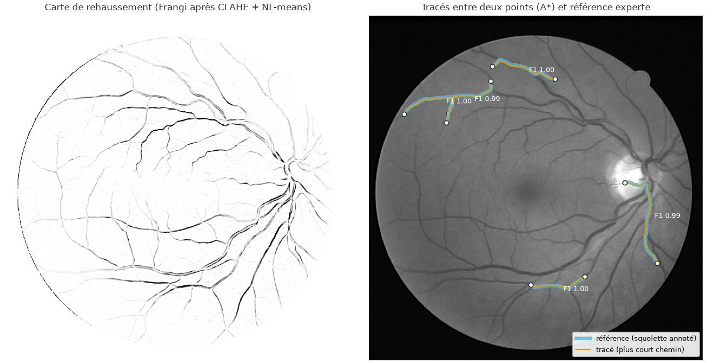
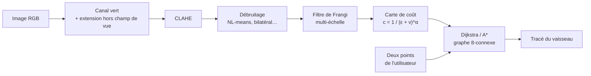

# Tracé des vaisseaux sanguins rétiniens par plus court chemin

[](https://github.com/sheene123/retina-vessel-tracing/actions/workflows/ci.yml)

Extraction du tracé d'un vaisseau sanguin sur une image de fond d'œil, à partir du jeu de
données public [DRIVE](https://drive.grand-challenge.org/). L'image est modélisée comme
un **graphe dont chaque pixel est un sommet**. À partir de deux points désignés par
l'utilisateur, un algorithme de **plus court chemin (Dijkstra, ou A\*)** suit le vaisseau
de l'un à l'autre.

Projet personnel en cours. Il comprend :
- le **prétraitement** des images pour réduire le bruit et rehausser les vaisseaux ;
- l'**exposition de l'algorithme** via une API FastAPI conteneurisée avec Docker et
  testée par GitHub Actions ;
- une question de fond : **comment évaluer objectivement un tracé face à une vérité
  terrain annotée par des experts ?** Voir [docs/evaluation.md](docs/evaluation.md).



## Principe



1. **Prétraitement** ([pretraitement.py](src/vaisseaux/pretraitement.py)). On part du
   canal vert, le plus contrasté pour les vaisseaux. On prolonge l'image hors du champ de
   vue, pour que le bord du disque ne soit pas pris pour un vaisseau, puis on égalise
   l'histogramme localement (CLAHE). On débruite ensuite ; le niveau de bruit est estimé
   par la méthode d'Immerkær et règle le NL-means. Enfin, le filtre de Frangi
   multi-échelle donne une « probabilité vaisseau » v ∈ [0, 1] pour chaque pixel.
2. **Graphe** ([graphe.py](src/vaisseaux/graphe.py)). Chaque pixel du champ de vue est
   relié à ses 8 voisins. Traverser un pixel coûte c = 1 / (ε + v)^α, soit environ 1 dans
   un vaisseau et environ 100^α dans le fond. L'arête (p, q) coûte
   d(p, q) · (c(p) + c(q)) / 2, avec d = 1 ou √2.
3. **Plus court chemin**. L'implémentation de Dijkstra utilise un tas binaire et s'arrête
   dès que la cible est atteinte. Une variante A\* utilise l'heuristique octile, admissible
   et cohérente, donc exacte. Les tests vérifient les coûts contre
   `scipy.sparse.csgraph.dijkstra`.

## Démo interactive

```bash
pip install gradio && python demo/app.py
```

Cliquez deux points sur un vaisseau : le tracé s'affiche avec sa longueur, le nombre de pixels
explorés et les durées. Le même fichier sert de Space Hugging Face ([demo/README.md](demo/README.md)).

## API

```bash
docker build -t vaisseaux .
docker run -p 8000:8000 vaisseaux
# documentation interactive : http://127.0.0.1:8000/docs

curl -F image=@data/DRIVE/test/images/02_test.tif \
     -F depart_x=300 -F depart_y=120 -F arrivee_x=360 -F arrivee_y=260 \
     http://127.0.0.1:8000/tracer
```

| Route | Rôle |
|---|---|
| `POST /tracer` | image + deux points (x = colonne, y = ligne) → liste des pixels du tracé, longueur, coût, pixels explorés, durées |
| `POST /tracer/image` | même calcul, renvoie l'image PNG avec le tracé superposé |
| `GET /sante` | sonde de vie |

Paramètres optionnels : `debruitage` (`aucun`, `gaussien`, `median`, `bilateral`,
`nl_means`), `algorithme` (`dijkstra`, `a_etoile`), `alpha`. Le prétraitement d'une image
est mis en cache : un second tracé sur la même image ne coûte que la recherche de chemin,
quelques dizaines de millisecondes.

## Évaluation

La question « mon tracé est-il bon ? » n'a pas de réponse évidente : le tracé est une
ligne, l'annotation experte est une surface, et les experts eux-mêmes ne sont pas
d'accord au pixel près. La démarche complète est dans [docs/evaluation.md](docs/evaluation.md).
En résumé :

- **Référence** : pour chaque paire de points tirée sur le squelette de l'annotation, le
  chemin géodésique le long de ce squelette.
- **Mesures de tracé** : précision et couverture avec tolérance de 2 px, F1, distance de
  Hausdorff à 95 %, distance de Fréchet (sensible à l'ordre de parcours), plus long
  écart hors d'un vaisseau (raccourci).
- **Mesures pixel** de la carte de rehaussement, **dans le champ de vue uniquement** :
  AUC, Dice, MCC, clDice. L'exactitude (*accuracy*) est trompeuse, car près de 87 % des
  pixels sont du fond.
- **Protocole** : paramètres choisis sur les 20 images d'entraînement, mesure unique sur
  les 20 images de test. Intervalles de confiance par bootstrap **sur les images** (l'image
  est l'unité statistique), test de Wilcoxon apparié corrigé par Holm.

Premiers résultats (20 images de test, 200 tracés par configuration) :

| Prétraitement | F1 tracé ↑ | Couverture ↑ | HD95 (px) ↓ | AUC pixel ↑ | MCC pixel ↑ |
|---|---|---|---|---|---|
| canal vert brut | 0,884 | 0,834 | 9,1 | 0,868 | 0,593 |
| CLAHE + NL-means | **0,885** | **0,836** | **9,0** | 0,874 | 0,606 |
| CLAHE + gaussien | 0,876 | 0,828 | 11,3 | **0,905** | **0,669** |
| CLAHE + bilatéral | 0,772 | 0,708 | 19,8 | 0,887 | 0,638 |

Le constat le plus instructif : **la meilleure carte au pixel (flou gaussien) ne donne pas
le meilleur tracé**, et le filtre bilatéral, correct au pixel, dégrade fortement les
tracés. Les mesures pixel et la tâche ne racontent pas la même histoire. Intervalles de
confiance, tests et analyse : [resultats/evaluation.md](resultats/evaluation.md) et
[docs/evaluation.md](docs/evaluation.md#6-ce-que-disent-les-résultats).

## Démarrage rapide

```bash
python -m venv .venv && source .venv/bin/activate
pip install -e ".[dev]"

python scripts/telecharger_drive.py          # ou --zip DRIVE.zip (archive officielle)
pytest                                       # tests (images synthétiques, pas besoin de DRIVE)
python -m vaisseaux.benchmark                # évaluation complète sur DRIVE
uvicorn vaisseaux.api:app --reload           # API en local
```

## Organisation

```
src/vaisseaux/
  donnees.py         chargement de DRIVE, estimation du masque de champ de vue
  pretraitement.py   CLAHE, débruitage, filtre de Frangi
  graphe.py          carte de coût, Dijkstra, A*
  evaluation.py      métriques de tracé et de segmentation, bootstrap, Wilcoxon
  benchmark.py       protocole d'évaluation entraînement / test
  api.py             API FastAPI
scripts/             téléchargement de DRIVE, figure
docs/evaluation.md   méthodologie d'évaluation
resultats/           résultats versionnés du dernier benchmark
```

## En cours et à venir

- [x] Graphe des pixels, Dijkstra et A\* validés contre SciPy
- [x] API FastAPI, image Docker, CI GitHub Actions
- [x] Protocole d'évaluation : métriques de tracé, bootstrap par image, tests appariés
- [ ] Prétraitement : réglage adaptatif du débruitage, correction d'illumination
- [ ] Coût appris (petit réseau de segmentation) à la place du filtre de Frangi
- [ ] Évaluation : second observateur (archive officielle), tolérance adaptée au calibre
      du vaisseau, étiquettes artère/veine pour vérifier l'identité du vaisseau aux
      croisements
- [ ] Généralisation à d'autres bases (STARE, CHASE_DB1, HRF)
- [x] Interface web : cliquer deux points et voir le tracé ([demo/](demo/), Space Hugging Face)

## Données

DRIVE : J. Staal, M. D. Abràmoff, M. Niemeijer, M. A. Viergever, B. van Ginneken,
*Ridge-based vessel segmentation in color images of the retina*, IEEE Transactions on
Medical Imaging, 2004. Les images ne sont pas redistribuées dans ce dépôt.

## Licence

MIT
