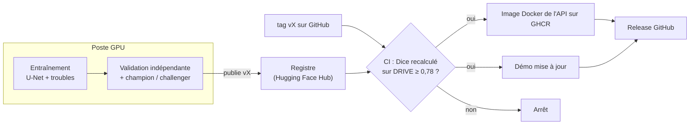

# Déploiement continu

Les modèles de ce projet (U-Net de segmentation, réseau des 6 troubles de l'œil) s'entraînent
sur GPU : le modèle des troubles voit 6 392 images en 5 plis, hors de portée des serveurs
gratuits de GitHub. Le circuit sépare donc l'entraînement, fait sur un poste GPU, de la
validation et du déploiement, automatisés.



## Publier une version

Sur le poste d'entraînement, une fois les modèles entraînés :

```bash
python scripts/publier_modeles.py --version v0.2.0      # registre : validation + comparaison
git tag v0.2.0 && git push origin v0.2.0                 # déclenche le déploiement
```

`publier_modeles.py` refuse la publication si :
- la **validation indépendante** échoue : le Dice du U-Net, recalculé avec ONNX Runtime sur les
  20 images de test DRIVE, doit dépasser 0,78, et le modèle des troubles doit répondre
  correctement ;
- une AUROC de trouble passe sous 0,75 ;
- le challenger **régresse face à la version en production** (Dice -0,01, AUROC -0,02 au plus).

En CI ([.github/workflows/deploiement.yml](../.github/workflows/deploiement.yml)), le tag
déclenche une **seconde validation indépendante**. La version est téléchargée depuis le registre
et le Dice est recalculé : il doit être au-dessus du seuil et identique à celui annoncé. Seule
cette version validée est déployée : image Docker de l'API sur GHCR, démo Hugging Face, release
GitHub.

## Revenir à une version

```bash
python scripts/deployer_space.py --space sheenee261/retina-vessel-tracing --depuis-registre v0.1.0
docker run -p 8000:8000 ghcr.io/sheene123/retina-vessel-tracing:v0.1.0
```

## Mise en place (une fois)

```bash
gh secret set HF_TOKEN --env production --repo sheene123/retina-vessel-tracing < ~/.cache/huggingface/token
```
