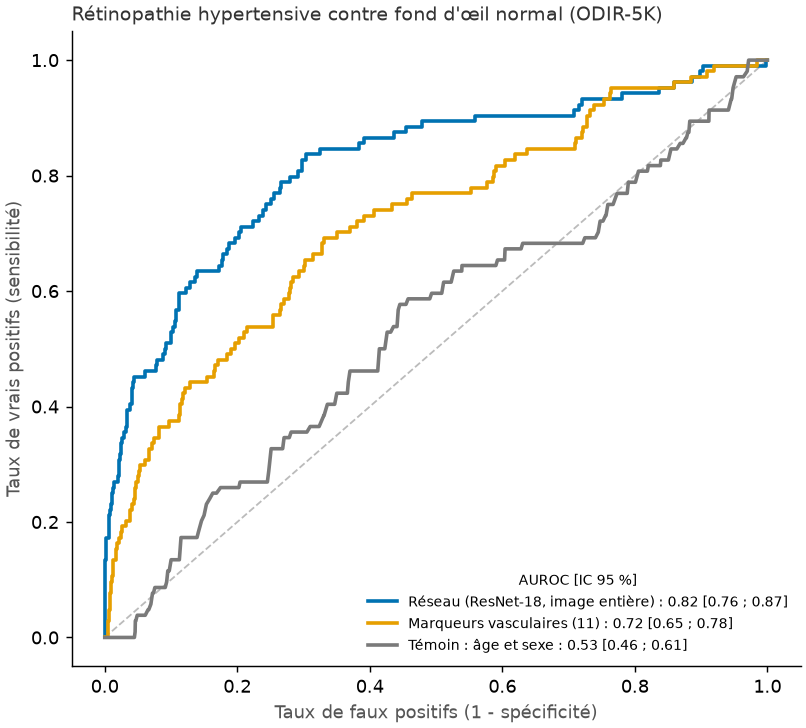

# Repérer une rétinopathie hypertensive : marqueurs vasculaires contre réseau de neurones

## Question

L'objectif à long terme est de reconnaître, sur une photo du fond d'œil, les patients à risque
cardiovasculaire. Les bases qui relient des images à des événements cardiaques (UK Biobank, par
exemple) sont en accès restreint. La base publique la plus proche est **ODIR-5K**, où des
ophtalmologistes ont noté, œil par œil, la présence d'une **rétinopathie hypertensive** :
l'atteinte des vaisseaux de la rétine causée par l'hypertension artérielle. C'est un signe
visible d'une maladie cardiovasculaire, **pas un diagnostic cardiaque**.

Deux questions :
1. Peut-on distinguer ces yeux des fonds d'œil normaux ?
2. Les **marqueurs vasculaires** du projet (mesurés sur la segmentation du U-Net) y suffisent-ils,
   ou faut-il un réseau qui regarde toute l'image ?

## Protocole

- **Données** : ODIR-5K (images prétraitées en 512 × 512). On garde les yeux dont le mot-clé
  propre à l'œil est exactement « hypertensive retinopathy » (104 yeux, 68 patients) ou
  « normal fundus » (2 816 yeux) : 2 920 yeux de 1 883 patients, soit 3,6 % de cas positifs.
- **Validation croisée en 5 plis, groupée par patient** : les deux yeux d'un même patient ne
  sont jamais l'un en apprentissage et l'autre en test. Chaque œil reçoit une prédiction faite
  par un modèle qui ne l'a jamais vu.
- **Trois modèles**, évalués sur les mêmes plis :

| Modèle | Entrée |
|---|---|
| Réseau | ResNet-18 pré-entraîné sur ImageNet, affiné sur l'image entière (384 × 384, 8 époques par pli) |
| Marqueurs | régression logistique sur les 11 marqueurs vasculaires, mesurés sur la segmentation du U-Net entraîné sur DRIVE (le U-Net n'a jamais vu ODIR) |
| Témoin | âge et sexe seulement, pour vérifier que les modèles lisent bien l'œil |

- **Mesure** : AUROC, avec un intervalle de confiance à 95 % par bootstrap sur les patients.
  Les différences entre modèles sont testées sur les mêmes tirages.

## Résultats



| Modèle | AUROC [IC 95 %] |
|---|---|
| Réseau (ResNet-18, image entière) | **0,82** [0,76 ; 0,87] |
| Marqueurs vasculaires (11) | 0,72 [0,65 ; 0,78] |
| Témoin : âge et sexe | 0,53 [0,46 ; 0,61] |

- **L'œil contient bien l'information** : les deux modèles d'image battent nettement le témoin
  âge et sexe (écart de +0,28 pour le réseau, IC [+0,19 ; +0,38] ; +0,18 pour les marqueurs,
  IC [+0,08 ; +0,28]).
- **Les marqueurs vasculaires en captent une partie, le réseau davantage** : +0,10 d'AUROC en
  faveur du réseau, IC [+0,03 ; +0,16]. La rétinopathie hypertensive ne se résume pas à la
  géométrie des vaisseaux : elle comporte aussi des hémorragies, des exsudats et des
  croisements artère/veine anormaux que nos marqueurs ne mesurent pas.
- **Les marqueurs qui pèsent le plus** (coefficients standardisés de la régression) sont la
  densité vasculaire (+1,05) et la densité de longueur du réseau principal (-1,60). Les deux
  vont en sens inverse, ce qui suggère une segmentation plus « épaisse » mais moins ramifiée
  chez les yeux atteints. À interpréter avec prudence, car les marqueurs sont corrélés entre
  eux.

**En pratique, c'est encore loin d'un outil de dépistage.** Avec 3,6 % de cas positifs, régler
le réseau pour détecter 80 % des yeux atteints donne une spécificité de 71 %, et seulement 9 %
des yeux signalés sont réellement atteints. Avec les marqueurs seuls, la spécificité tombe à
41 % pour la même sensibilité.

## Limites

- 68 patients atteints seulement : les intervalles de confiance sont larges.
- Une seule base et une seule annotation par œil, sans second lecteur. Le label « hypertensive
  retinopathy » dépend du jugement du lecteur et ne dit pas si la tension du patient est
  mesurée élevée.
- On exclut les yeux qui cumulent plusieurs atteintes, par exemple une rétinopathie diabétique
  en plus : la tâche est plus simple que la réalité clinique.
- Le U-Net a été entraîné sur DRIVE (autre appareil, autre population) : ses segmentations
  d'ODIR n'ont pas été vérifiées contre une annotation.
- La rétinopathie hypertensive n'est pas une maladie cardiaque : c'est un marqueur d'atteinte
  vasculaire liée à l'hypertension.

## Reproduire

```bash
pip install -e ".[dev,ml]" torchvision timm scikit-learn pandas
python -c "import kagglehub; print(kagglehub.dataset_download('andrewmvd/ocular-disease-recognition-odir5k'))"
python -m vaisseaux.hypertension --odir <dossier affiché ci-dessus>   # environ 10 minutes sur GPU
```

## Références

- ODIR-2019 (*Ocular Disease Intelligent Recognition*), Université de Pékin, jeu de données public.
- Zhou Y. et al. *A foundation model for generalizable disease detection from retinal images*
  (RETFound). Nature, 2023.
